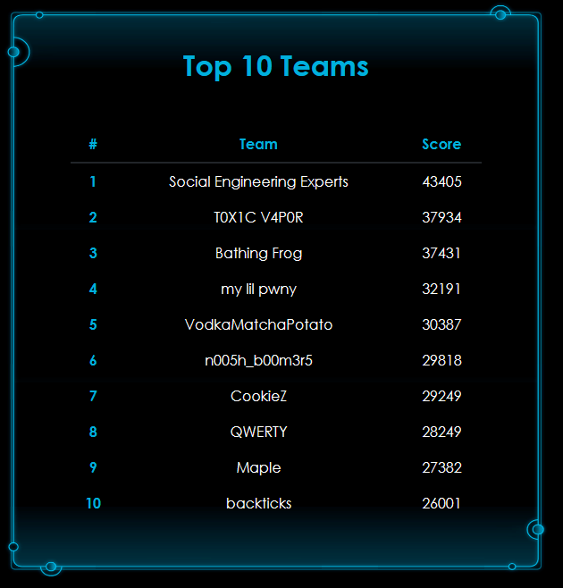
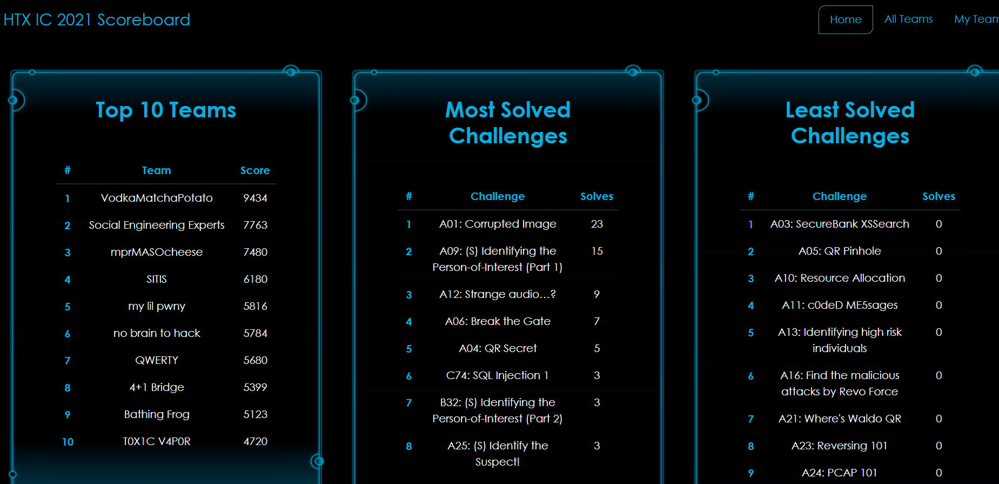
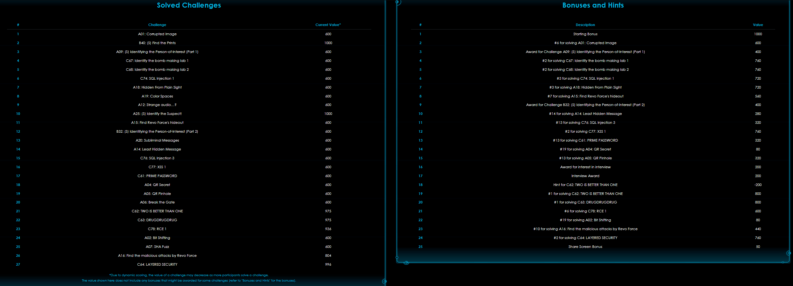

# HTXIC 21 Writeup

This is a collection of writeups for challenges in HTXIC 2021.

## Final Rank

~~5th~~ 4th place at the end, after conisdering the rearrangement of positions due to a disqualification.

The top team, Social Engineering Experts were disqualified. Being a group of NSFs who graduated from JCs, they did not meet the criteria for participation. In all honesty, they deserved the win.

We were first for the first few hours though.

## Challenges

| Challenge                                                 | Category | Solved | Base Points + Bonus |
| --------------------------------------------------------- | :------: | ------ | ------------------- |
| [A01 - Broken System](./puzzles/A01.md)                   |  Stego   | Y      | 600 + 600           |
| [Let's Go Hunting - Track Him Down!](./puzzles/OSINT2.md) |  OSINT   | Y      | 500                 |

### Scoring

# Finished but not written questions:

1. A04
2. A05

3. A12

4. A15 - completely forgot what this was
5. A19 - @huixiang

Look through the stuff and just feel free to add if im missing something
